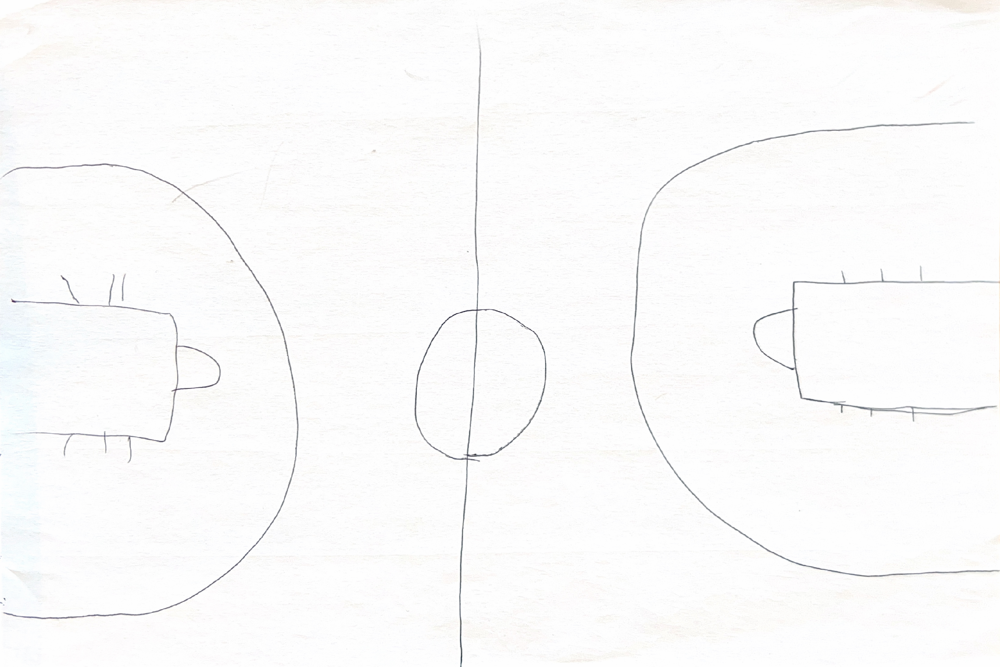

# Project Proposal

1. Roughly, what will your drawing look like
i want to make a basketball court

2. What are two variables you could use so that when you change each variable, the drawing changes?

to make the parobla shape i will need to make a variable that changes and also im gonna repeat the whole code twice but change a variable that is next to each number that changes negetive to duplicate them
3. Where is there repetition in your drawing?
i will repeat to make circle and also put it on the other side

4. What are the main parts of your drawing? Are there clear sections or objects?
there are clear sections where the 

5. How could you use a loop variable of a for loop? Is there somewhere in your drawing where something is repeated, but it's slightly different each time? Maybe the same object is repeated in different places, or maybe a similar object is repeated but with different sizes?

i would first repeat a lot of stuff to make a circles and half circles for the court and after that i would repeat the whole thing to be on the other side

6. sketch your image, take a pciture, and add it here!

